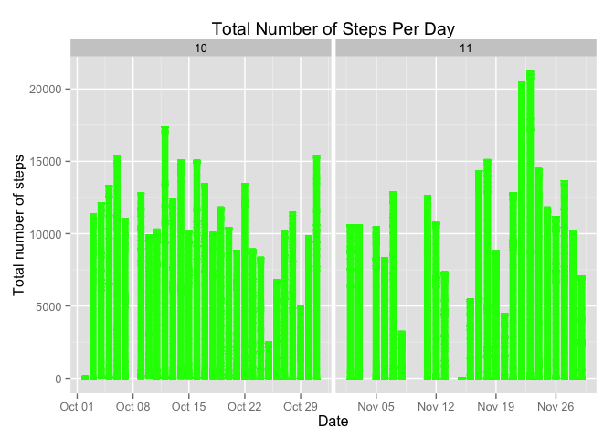
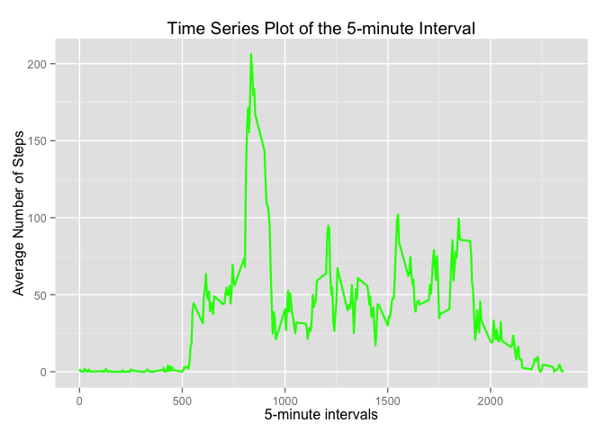
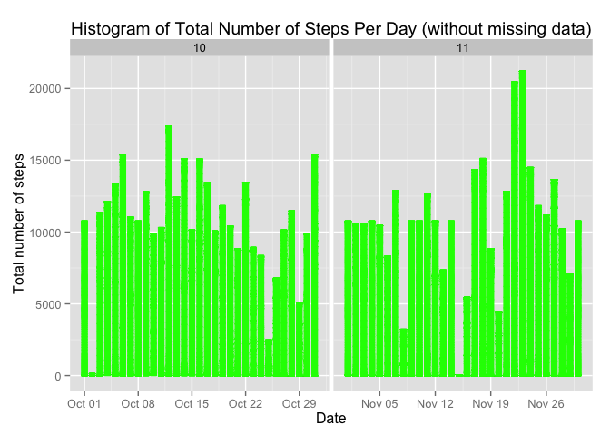

## Peer Assessment 1 

### Azade Sanjari, asanjari@indiana.edu

### Reproducible Research - Coursera

```
## Warning: package 'knitr' was built under R version 3.1.1
```

### Loading and preprocessing the data
* Getting the Data

```r
if(!file.exists("data")){
        dir.create("data")
        }
fileURL <- "https://d396qusza40orc.cloudfront.net/repdata%2Fdata%2Factivity.zip"
download.file(fileURL, destfile="./data/activity.zip", method="curl")
unzip("./data/activity.zip", exdir="./data")
```

* Reading and preprocessing the Data

```r
activityData <- read.csv("./data/activity.csv", colClasses=c("integer", "Date", "integer"))
activityData$month <- as.numeric(format(activityData$date, "%m"))
activityDataNoNA <- na.omit(activityData)
summary(activityData)
```

```
##      steps             date               interval          month      
##  Min.   :  0.00   Min.   :2012-10-01   Min.   :   0.0   Min.   :10.00  
##  1st Qu.:  0.00   1st Qu.:2012-10-16   1st Qu.: 588.8   1st Qu.:10.00  
##  Median :  0.00   Median :2012-10-31   Median :1177.5   Median :10.00  
##  Mean   : 37.38   Mean   :2012-10-31   Mean   :1177.5   Mean   :10.49  
##  3rd Qu.: 12.00   3rd Qu.:2012-11-15   3rd Qu.:1766.2   3rd Qu.:11.00  
##  Max.   :806.00   Max.   :2012-11-30   Max.   :2355.0   Max.   :11.00  
##  NA's   :2304
```

```r
head(activityData)
```

```
##   steps       date interval month
## 1    NA 2012-10-01        0    10
## 2    NA 2012-10-01        5    10
## 3    NA 2012-10-01       10    10
## 4    NA 2012-10-01       15    10
## 5    NA 2012-10-01       20    10
## 6    NA 2012-10-01       25    10
```

### What is mean total number of steps taken per day?
* Make a histogram of the total number of steps taken each day

```r
library(ggplot2)
ggplot(activityDataNoNA, aes(date, steps)) + geom_bar(stat = "identity", colour = "green", fill = "green", width = 0.7) + facet_grid(. ~ month, scales = "free") + labs(title = "Total Number of Steps Per Day", x = "Date", y = "Total number of steps")
```

 

* Calculate and report the mean and median total number of steps taken per day

```r
totalStepsPerDay <- aggregate(activityData$steps, list(activityData$date), FUN = sum, na.rm=TRUE)
head(totalStepsPerDay)
```

```
##      Group.1     x
## 1 2012-10-01     0
## 2 2012-10-02   126
## 3 2012-10-03 11352
## 4 2012-10-04 12116
## 5 2012-10-05 13294
## 6 2012-10-06 15420
```

```r
meanSteps <- mean(totalStepsPerDay$x)
medianSteps <- median(totalStepsPerDay$x)
```

Mean of total number of steps per day is 9354.2295082 and Median of total number of steps per day is 10395.

### What is the average daily activity pattern?
* Make a time series plot (i.e. type = "l") of the 5-minute interval (x-axis) and the average number of steps taken, averaged across all days (y-axis)

```r
averageSteps <- aggregate(activityDataNoNA$steps, list(interval = as.numeric(as.character(activityDataNoNA$interval))), FUN = "mean")
names(averageSteps)[2] <- "meanOfSteps"
ggplot(averageSteps, aes(interval, meanOfSteps)) + geom_line(color = "green", size = 0.8) + labs(title = "Time Series Plot of the 5-minute Interval", x = "5-minute intervals", y = "Average Number of Steps")
```

 

* Which 5-minute interval, on average across all the days in the dataset, contains the maximum number of steps?

```r
averageSteps[averageSteps$meanOfSteps == max(averageSteps$meanOfSteps), ]
```

```
##     interval meanOfSteps
## 104      835    206.1698
```

### Imputing missing values
* Calculate and report the total number of missing values in the dataset (i.e. the total number of rows with NAs)

```r
sum(is.na(activityData))
```

```
## [1] 2304
```

* Devise a strategy for filling in all of the missing values in the dataset. The strategy does not need to be sophisticated. For example, you could use the mean/median for that day, or the mean for that 5-minute interval, etc.

I will use the mean for that 5-minute interval to fill each NA value in the steps column.

* Create a new dataset that is equal to the original dataset but with the missing data filled in.

```r
DATA <- activityData
for (i in 1:nrow(DATA)){
        if (is.na(DATA$steps[i])){
                DATA$steps[i] <- averageSteps[which(DATA$interval[i]==averageSteps$interval),         ]$meanOfSteps
                }
        }
head(DATA)
```

```
##       steps       date interval month
## 1 1.7169811 2012-10-01        0    10
## 2 0.3396226 2012-10-01        5    10
## 3 0.1320755 2012-10-01       10    10
## 4 0.1509434 2012-10-01       15    10
## 5 0.0754717 2012-10-01       20    10
## 6 2.0943396 2012-10-01       25    10
```

```r
sum(is.na(DATA))
```

```
## [1] 0
```

* Make a histogram of the total number of steps taken each day and Calculate and report the mean and median total number of steps taken per day. 

```r
ggplot(DATA, aes(date, steps)) + geom_bar(stat = "identity", colour = "green", fill = "green", width = 0.7) + facet_grid(. ~ month, scales = "free") + labs(title = "Histogram of Total Number of Steps Per Day (without missing data)", x = "Date", y = "Total number of steps")
```

 

* Do these values differ from the estimates from the first part of the assignment? What is the impact of imputing missing data on the estimates of the total daily number of steps?

first I will calculate the Mean of total number of steps taken per day in the data set without any missing data:

```r
totalStepsNoNA <- aggregate(DATA$steps, list(DATA$date), FUN = sum)
meanStepsNoNA <- mean(totalStepsNoNA$x)
meanStepsNoNA
```

```
## [1] 10766.19
```

then the Median of total number of steps taken per day in the data set without any missing data:

```r
medianStepsNoNA <- median(totalStepsNoNA$x)
medianStepsNoNA
```

```
## [1] 10766.19
```

Comparing these two value with mean and median before imputing missing data:

```r
meanStepsNoNA - meanSteps
```

```
## [1] 1411.959
```

```r
medianStepsNoNA - medianSteps
```

```
## [1] 371.1887
```
After imputing the missing data, the mean of total steps per day is the same as the old mean; the new median of total steps per day is greater than the old median.

### Are there differences in activity patterns between weekdays and weekends?
* Create a new factor variable in the dataset with two levels – “weekday” and “weekend” indicating whether a given date is a weekday or weekend day.

```r
DATA$weekdays <- factor(format(DATA$date, "%A"))
levels(DATA$weekdays)
```

```
## [1] "Friday"    "Monday"    "Saturday"  "Sunday"    "Thursday"  "Tuesday"  
## [7] "Wednesday"
```

```r
levels(DATA$weekdays) <- list(weekday = c("Monday", "Tuesday", "Wednesday", "Thursday", "Friday"), weekend = c("Saturday", "Sunday"))
levels(DATA$weekdays)
```

```
## [1] "weekday" "weekend"
```

```r
table(DATA$weekdays)
```

```
## 
## weekday weekend 
##   12960    4608
```

* Make a panel plot containing a time series plot (i.e. type = "l") of the 5-minute interval (x-axis) and the average number of steps taken, averaged across all weekday days or weekend days (y-axis).

```r
averageSteps <- aggregate(DATA$steps, list(interval = as.numeric(as.character(DATA$interval)), weekdays = DATA$weekdays), FUN = mean)
names(averageSteps)[3] <- "meanOfSteps"
library(lattice)
xyplot(averageSteps$meanOfSteps ~ averageSteps$interval | averageSteps$weekdays, layout = c(1, 2), type = "l", xlab = "Interval", ylab = "Number of steps")
```

 
